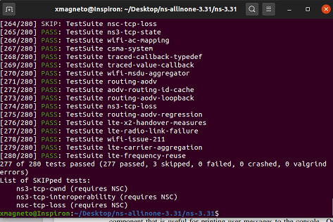
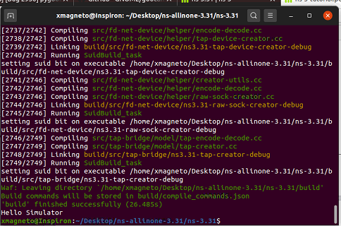
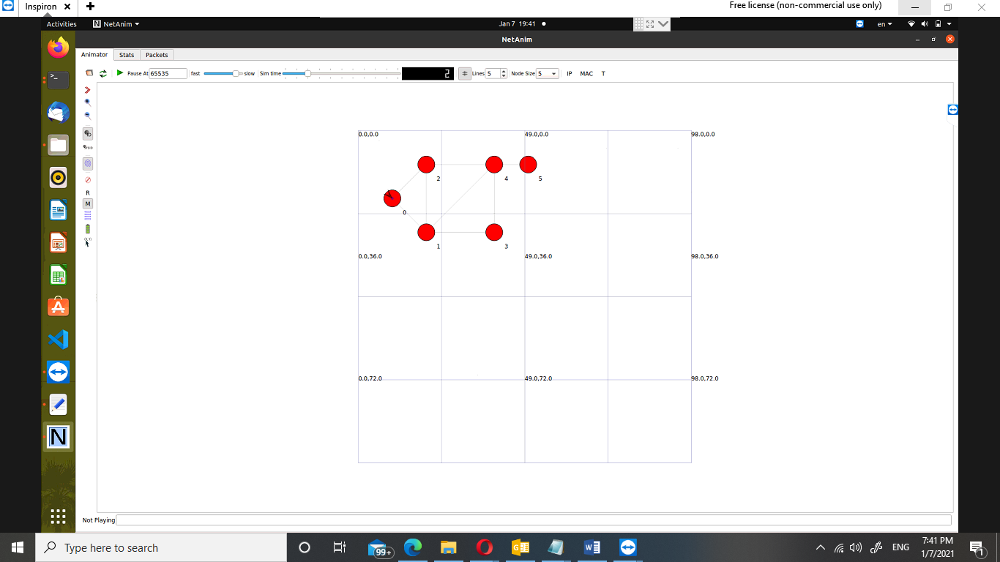

NETWORKS
ASSIGNMENT 3 - ROUTING PROTOCOLS
**8th January 2021**

# OSPF-Routing-Protocol-using-NS3
Create a script that simulates a topology, with nodes having point to points links, and internet stack installed. Get the nodes to build their routing tables and update the NS3 source code to filter the routes keeping only the route with the min number of hops (least cost).

## **Download NS3, build it and run the hello world example**
Because of this issue :
E: Unable to locate package python python-pygoocanvas
E: Unable to locate package libgoocanvas-dev

I found it here:  <https://itectec.com/ubuntu/ubuntu-unable-to-locate-package-python-pygoocanvas/>

The solution was to use an ns -3 version above 29 because I had Ubuntu above 18 so I used version **31.**

**Tests: à**

**Hello Simulation:**

## **NS3 source code updated.**
The updated part for adding only one route with minimum cost is to remove this part “Make it a comment” and add continue to be as the previous condition of routs not has lower cost. In “global-route-manager-impl.cc” file

`          `else if (cw->GetDistanceFromRoot () == distance)

`            `{

//

// This path is one with an equal cost.

//

`              `NS\_LOG\_LOGIC ("Equal cost multiple paths found.");

// At this point, there are two instances 'w' and 'cw' of the

// same vertex, the vertex that is currently being considered

// for adding into the shortest path tree. 'w' is the instance

// as seen from the root via vertex 'v', and 'cw' is the instance 

// as seen from the root via some other vertices other than 'v'.

// These two instances are being merged in the following code.

// In particular, the parent nodes, the next hops, and the root's

// output interfaces of the two instances are being merged.

// 

// Note that this is functionally equivalent to calling

// ospf\_nexthop\_merge (cw->nexthop, w->nexthop) in quagga-0.98.6

// (ospf\_spf.c::859), although the detail implementation

// is very different from quagga (blame ns3::GlobalRouteManagerImpl)

// prepare vertex w

`          `/\*    w = new SPFVertex (w\_lsa);

`              `SPFNexthopCalculation (v, w, l, distance);

`              `cw->MergeRootExitDirections (w);

`              `cw->MergeParent (w);

// SPFVertexAddParent (w) is necessary as the destructor of 

// SPFVertex checks if the vertex and its parent is linked

// bidirectionally

`              `SPFVertexAddParent (w);

`              `delete w;

`              `\*/

`              `continue;

`            `}
## **A description of the contribution introduced to code.**
## **Sample test runs to illustrate the printed routing tables, and the routes taken by transferring packets between nodes**
**Before & After Changing Source Code:

 

**Run** 

ns-3.31$ ./waf --run scratch/assignment3
netanim-3.108$ ./NetAnim
choose Assignment3.xml

