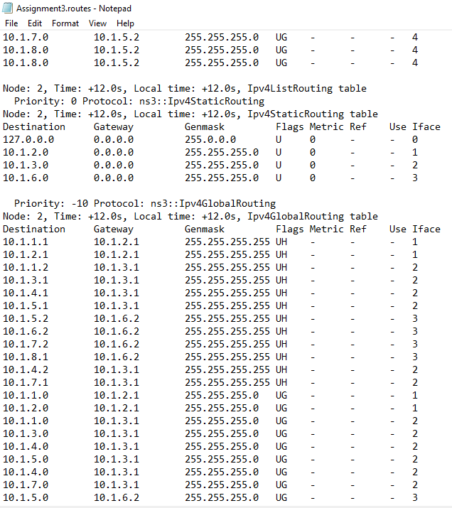
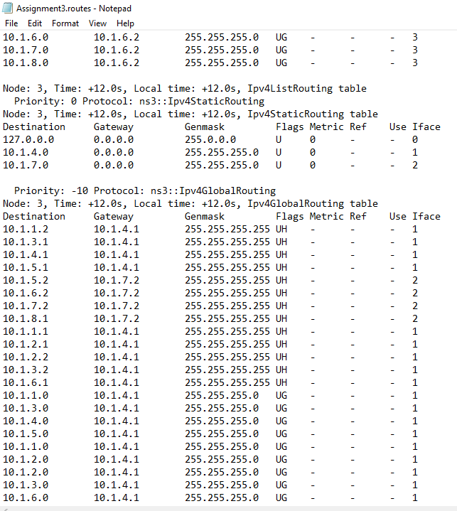
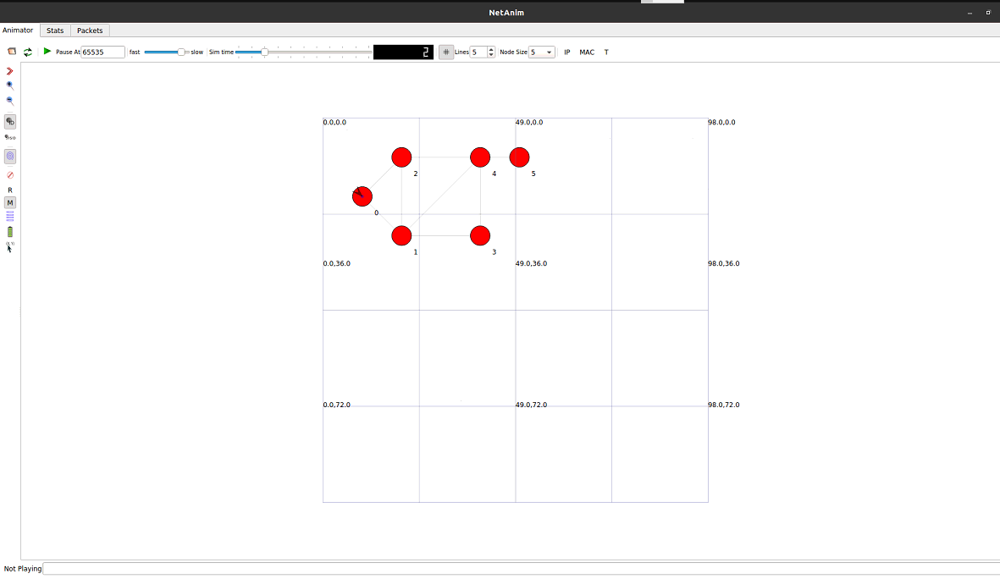

NETWORKS
ASSIGNMENT 3 - ROUTING PROTOCOLS
**8th January 2021**

# OSPF-Routing-Protocol-using-NS3
Create a script that simulates a topology, with nodes having point to points links, and internet stack installed. Get the nodes to build their routing tables and update the NS3 source code to filter the routes keeping only the route with the min number of hops (least cost).

## **Download NS3, build it and run the hello world example**
Because of this issue :
E: Unable to locate package python python-pygoocanvas
E: Unable to locate package libgoocanvas-dev

I found it here:  <https://itectec.com/ubuntu/ubuntu-unable-to-locate-package-python-pygoocanvas/>

The solution was to use an ns -3 version above 29 because I had Ubuntu above 18 so I used version **31.**

**Tests: à**

**Hello Simulation:**

## **NS3 source code updated.**
The updated part for adding only one route with minimum cost is to remove this part “Make it a comment” and add continue to be as the previous condition of routs not has lower cost. In “global-route-manager-impl.cc” file

`          `else if (cw->GetDistanceFromRoot () == distance)

`            `{

//

// This path is one with an equal cost.

//

`              `NS\_LOG\_LOGIC ("Equal cost multiple paths found.");

// At this point, there are two instances 'w' and 'cw' of the

// same vertex, the vertex that is currently being considered

// for adding into the shortest path tree. 'w' is the instance

// as seen from the root via vertex 'v', and 'cw' is the instance 

// as seen from the root via some other vertices other than 'v'.

// These two instances are being merged in the following code.

// In particular, the parent nodes, the next hops, and the root's

// output interfaces of the two instances are being merged.

// 

// Note that this is functionally equivalent to calling

// ospf\_nexthop\_merge (cw->nexthop, w->nexthop) in quagga-0.98.6

// (ospf\_spf.c::859), although the detail implementation

// is very different from quagga (blame ns3::GlobalRouteManagerImpl)

// prepare vertex w

`          `/\*    w = new SPFVertex (w\_lsa);

`              `SPFNexthopCalculation (v, w, l, distance);

`              `cw->MergeRootExitDirections (w);

`              `cw->MergeParent (w);

// SPFVertexAddParent (w) is necessary as the destructor of 

// SPFVertex checks if the vertex and its parent is linked

// bidirectionally

`              `SPFVertexAddParent (w);

`              `delete w;

`              `\*/

`              `continue;

`            `}
## **A description of the contribution introduced to code.**
#include <iostream>

#include <fstream>

#include <string>

#include <cassert>

#include "ns3/core-module.h"

#include "ns3/network-module.h"

#include "ns3/csma-module.h"

#include "ns3/internet-module.h"

#include "ns3/point-to-point-module.h"

#include "ns3/applications-module.h"

#include "ns3/ipv4-global-routing-helper.h"

#include "ns3/netanim-module.h"

using namespace ns3;

NS\_LOG\_COMPONENT\_DEFINE ("Assignment3");

int 

main (int argc, char \*argv[])

{

`  `CommandLine cmd (\_\_FILE\_\_);

`  `cmd.Parse (argc, argv);

`  `NS\_LOG\_INFO ("Create nodes.");

nodes have point to point links, and internet stack installed.

nodes have point to point links, and internet stack installed.  NodeContainer c;

`  `c.Create (6);

`  `NodeContainer n0n1 = NodeContainer (c.Get (0), c.Get (1));

`  `NodeContainer n0n2 = NodeContainer (c.Get (0), c.Get (2));

`  `NodeContainer n1n2 = NodeContainer (c.Get (1), c.Get (2));

`  `NodeContainer n1n3 = NodeContainer (c.Get (1), c.Get (3));

`  `NodeContainer n1n4 = NodeContainer (c.Get (1), c.Get (4));

`  `NodeContainer n2n4 = NodeContainer (c.Get (2), c.Get (4));

`  `NodeContainer n3n4 = NodeContainer (c.Get (3), c.Get (4));

`  `NodeContainer n4n5 = NodeContainer (c.Get (4), c.Get (5));

`  `InternetStackHelper internet;

`  `internet.Install (c);

`  `// As in Example of Global Routing Protocol in NS-3

`  `// We create the channels first without any IP addressing information

`  `NS\_LOG\_INFO ("Create channels.");

`  `PointToPointHelper p2p;

`  `p2p.SetDeviceAttribute ("DataRate", StringValue ("5Mbps"));

`  `p2p.SetChannelAttribute ("Delay", StringValue ("2ms"));

`  `NetDeviceContainer d0d1 = p2p.Install (n0n1);

`  `NetDeviceContainer d0d2 = p2p.Install (n0n2);

`  `NetDeviceContainer d1d2 = p2p.Install (n1n2);

`  `NetDeviceContainer d1d3 = p2p.Install (n1n3);

`  `NetDeviceContainer d1d4 = p2p.Install (n1n4);

`  `NetDeviceContainer d2d4 = p2p.Install (n2n4);

`  `NetDeviceContainer d3d4 = p2p.Install (n3n4);

`  `NetDeviceContainer d4d5 = p2p.Install (n4n5);

`  `// Later, we add IP addresses.

`  `NS\_LOG\_INFO ("Assign IP Addresses.");

`  `Ipv4AddressHelper ipv4;

`  `ipv4.SetBase ("10.1.1.0", "255.255.255.0");

`  `Ipv4InterfaceContainer i0i1 = ipv4.Assign (d0d1);

`  `ipv4.SetBase ("10.1.2.0", "255.255.255.0");

Adding IP Addresses for each channel

Adding IP Addresses for each channel  Ipv4InterfaceContainer i0i2 = ipv4.Assign (d0d2);

`  `ipv4.SetBase ("10.1.3.0", "255.255.255.0");

`  `Ipv4InterfaceContainer i1i2 = ipv4.Assign (d1d2);

`  `ipv4.SetBase ("10.1.4.0", "255.255.255.0");

`  `Ipv4InterfaceContainer i1i3 = ipv4.Assign (d1d3); 

`  `ipv4.SetBase ("10.1.5.0", "255.255.255.0");

`  `Ipv4InterfaceContainer i1i4 = ipv4.Assign (d1d4);

`  `ipv4.SetBase ("10.1.6.0", "255.255.255.0");

`  `Ipv4InterfaceContainer i2i4 = ipv4.Assign (d2d4);

`  `ipv4.SetBase ("10.1.7.0", "255.255.255.0");

`  `Ipv4InterfaceContainer i3i4 = ipv4.Assign (d3d4);

`  `ipv4.SetBase ("10.1.8.0", "255.255.255.0");

`  `Ipv4InterfaceContainer i4i5 = ipv4.Assign (d4d5);

`  `// Create router nodes, initialize routing database and set up the routing

`  `// tables in the nodes.

`  `Ipv4GlobalRoutingHelper: PopulateRoutingTables ();

`  `// Create a server and 5 clients

`  `// As in Example of tutorail for NS-3 in https://www.nsnam.org/docs/release/3.18/doxygen/first\_8cc\_source.html

`  `NS\_LOG\_INFO ("Create Applications.");

Creating 1 Server and 5 Clients

Creating 1 Server and 5 Clients  uint16\_t port = 9;

`  `UdpEchoServerHelper echoServer (port);

`  `ApplicationContainer server = echoServer.Install (c.Get (5));

`  `server.Start (Seconds (1.0));

`  `server.Stop (Seconds (15.0)); 

`  `UdpEchoClientHelper echoClient (i4i5.GetAddress (1), port);

`  `echoClient.SetAttribute ("MaxPackets", UintegerValue (1));

`  `echoClient.SetAttribute ("Interval", TimeValue (Seconds (1.0)));

`  `echoClient.SetAttribute ("PacketSize", UintegerValue (1024));

`  `ApplicationContainer client0 = echoClient.Install (c.Get (0));

`  `client0.Start (Seconds (2.0));

`  `client0.Stop (Seconds (15.0));

`  `ApplicationContainer client1 = echoClient.Install (c.Get (1));

`  `client1.Start (Seconds (4.0));

`  `client1.Stop (Seconds (15.0));

`  `ApplicationContainer client2 = echoClient.Install (c.Get (2));

`  `client2.Start (Seconds (6.0));

`  `client2.Stop (Seconds (15.0));

`  `ApplicationContainer client3 = echoClient.Install (c.Get (3));

`  `client3.Start (Seconds (8.0));

`  `client3.Stop (Seconds (15.0));

`  `ApplicationContainer client4 = echoClient.Install (c.Get (4));

`  `client4.Start (Seconds (10.0));

Printing Routing table

Printing Routing table  client4.Stop (Seconds (15.0));

`  `// Trace routing tables 

`  `Ipv4GlobalRoutingHelper g;

`  `Ptr<OutputStreamWrapper> routingStream = Create<OutputStreamWrapper> ("Assignment3.routes", std::ios::out);

`  `g.PrintRoutingTableAllAt (Seconds (12), routingStream);

`  `// make animation for our topology

`  `// From this tutorial of NS-3 https://www.nsnam.org/docs/release/3.13/models/html/animation.html

Add Animation for topology and set positions for nodes

Add Animation for topology and set positions for nodes  AnimationInterface anim ("assignment3.xml");

`  `// set positions as in assignment pdf

`  `anim.SetConstantPosition(c.Get(0), 10,20);

`  `anim.SetConstantPosition(c.Get(1), 20,30);

`  `anim.SetConstantPosition(c.Get(2), 20,10);

`  `anim.SetConstantPosition(c.Get(3), 40,30);

`  `anim.SetConstantPosition(c.Get(4), 40,10);

`  `anim.SetConstantPosition(c.Get(5), 50,10);

`  `NS\_LOG\_INFO ("Run Simulation.");

`  `Simulator::Run ();

`  `Simulator::Destroy ();

`  `NS\_LOG\_INFO ("Done.");

## **Sample test runs to illustrate the printed routing tables, and the routes taken by transferring packets between nodes**
**Before Changing Source Code:

**

## **After Changing Source Code**

 

 

**Run** 

ns-3.31$ ./waf --run scratch/assignment3
netanim-3.108$ ./NetAnim
choose Assignment3.xml

